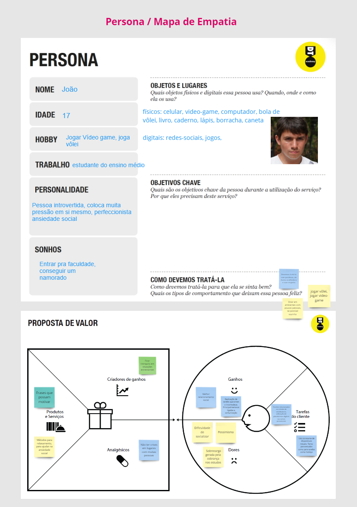
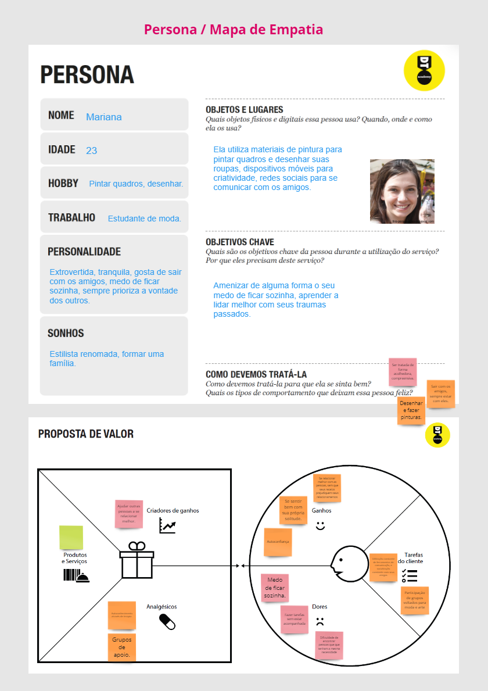
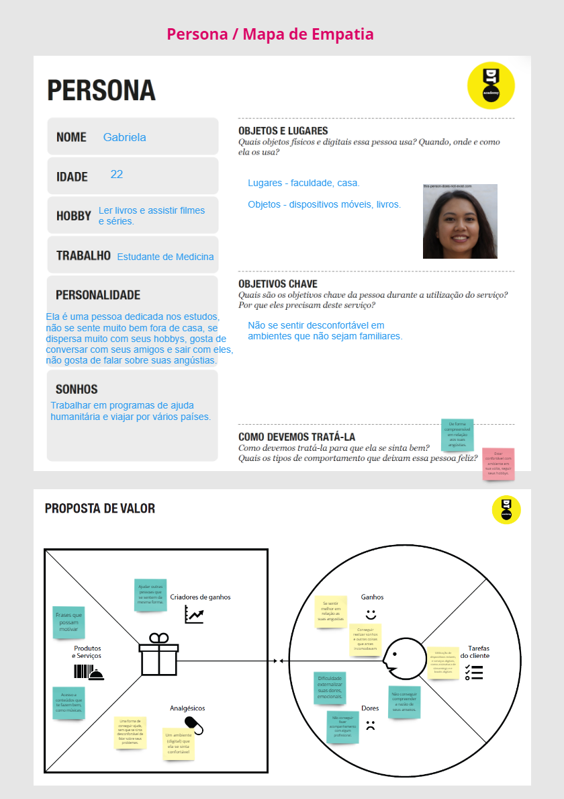
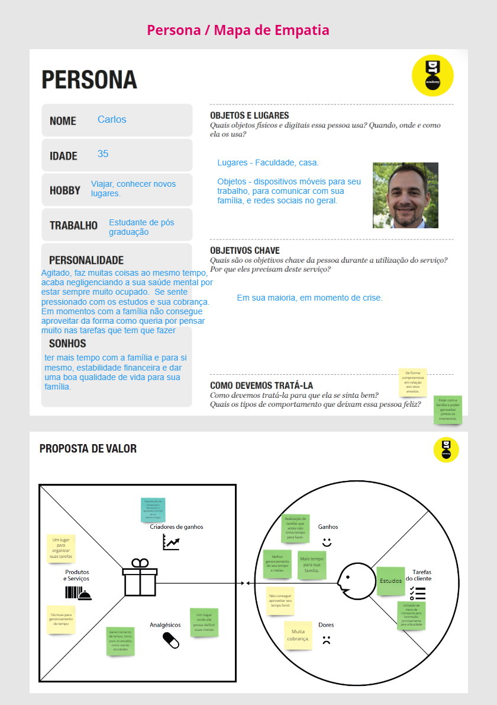
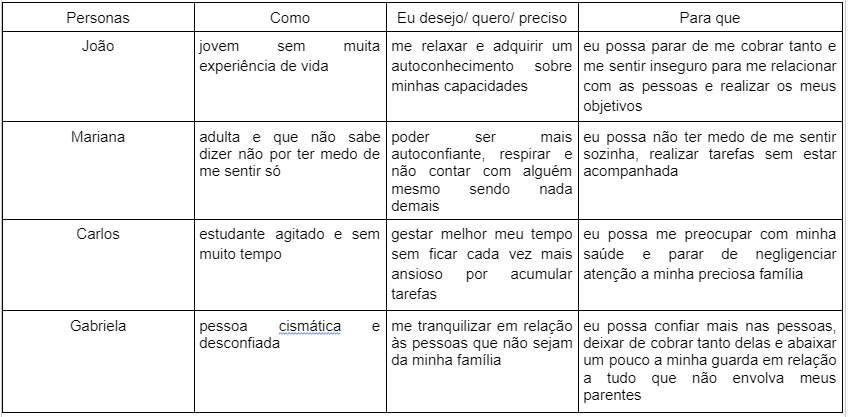
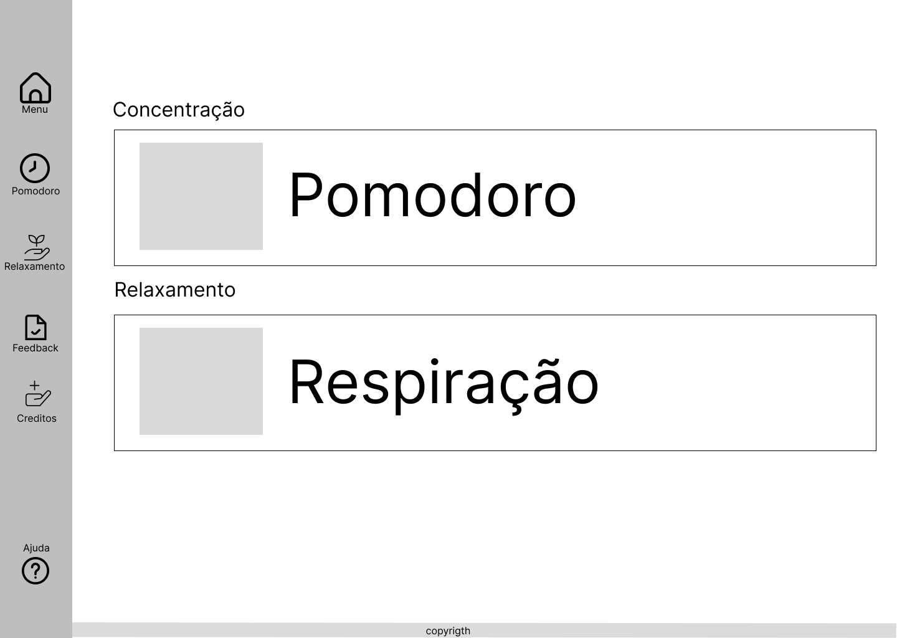
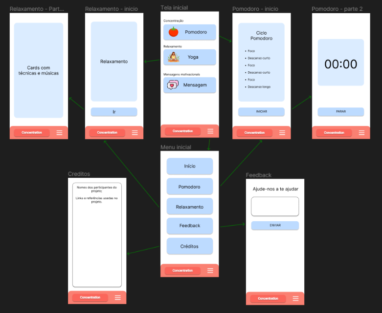

# Informações do Projeto
`TÍTULO DO PROJETO`  

Concentration

`CURSO` 

Engenharia de Software / manhã - 1º semestre 2023

## Participantes

> Os membros do grupo são: 
 - Cauan Augusto Morais São José
 - Conrado Piccinini Bolognani
 - Davi Augusto Dias Soares
 - Gabriel Henrique Silva Pereira

# Estrutura do Documento

- [Informações do Projeto](#informações-do-projeto)
  - [Participantes](#participantes)
- [Estrutura do Documento](#estrutura-do-documento)
- [Introdução](#introdução)
  - [Problema](#problema)
  - [Objetivos](#objetivos)
  - [Justificativa](#justificativa)
  - [Público-Alvo](#público-alvo)
- [Especificações do Projeto](#especificações-do-projeto)
  - [Personas, Empatia e Proposta de Valor](#personas-empatia-e-proposta-de-valor)
  - [Histórias de Usuários](#histórias-de-usuários)
  - [Requisitos](#requisitos)
    - [Requisitos Funcionais](#requisitos-funcionais)
    - [Requisitos não Funcionais](#requisitos-não-funcionais)
  - [Restrições](#restrições)
- [Projeto de Interface](#projeto-de-interface)
  - [User Flow](#user-flow)
  - [Wireframes](#wireframes)
- [Metodologia](#metodologia)
  - [Divisão de Papéis](#divisão-de-papéis)
  - [Ferramentas](#ferramentas)
  - [Controle de Versão](#controle-de-versão)
- [**############## SPRINT 1 ACABA AQUI #############**](#-sprint-1-acaba-aqui-)
- [Projeto da Solução](#projeto-da-solução)
  - [Tecnologias Utilizadas](#tecnologias-utilizadas)
  - [Arquitetura da solução](#arquitetura-da-solução)
- [Avaliação da Aplicação](#avaliação-da-aplicação)
  - [Plano de Testes](#plano-de-testes)
  - [Ferramentas de Testes (Opcional)](#ferramentas-de-testes-opcional)
  - [Registros de Testes](#registros-de-testes)
- [Referências](#referências)

# Introdução

## Problema

O problema identificado pelo grupo e que a os problemas envolvendo  ansiedade no ambiente estudantil "tamto escola como faculdade "cresceu após a pandemia  chegando a níveis alarmantes

## Objetivos

Criar um APP que trará as diversas funcionalidades tais como as técnicas de relançamento que vão proporcionar uma mitigação do problema  

## Justificativa

Pela junção da entrevista e da vivência dos integrantes do grupo concluímos que criar um aplicativo que reúna técnicas de estudo e de relacionamento  

## Público-Alvo

O nosso público alvo tem como foco as pessoas mais jovens entre 16 a 35, que fazem graduação, ou estejam em outro nível de escolaridade. No processo de Design Thinking conseguimos conhecer melhor o público, percebemos também, através do processo de pesquisa, uma incidência maior de ansiedade em ambientes escolares, tanto em instituições de ensino fundamental, como em ambientes acadêmicos. Tendo como demanda, dificuldades parecidas quanto ao processo de lidar com a ansiedade. Percebemos também, que atualmente, esse público é constantemente exposto a informações de todo tipo, por meio dos dispositivos móveis. Utilizando os mesmos não só para questões pessoais, mas também como ferramentas de estudos e trabalho, sendo uma geração completamente conectada com a tecnologia.
 
# Especificações do Projeto

- Entrevistas: foram realizadas entrevistas com estudantes de diferentes níveis educacionais 
- Brainstorming: uma técnica de brainstorming foi utilizada para gerar ideias sobre as funcionalidades que o aplicativo deveria ter para ajudar a lidar com a ansiedade
- Documentação técnica: durante todo o processo de especificação do projeto, foram criados documentos técnicos que descrevem as funcionalidades, fluxos de navegação e requisitos do aplicativo.
- Prototipagem: foram criados protótipos do aplicativo para testar a usabilidade e a experiência do usuário. 

## Personas, Empatia e Proposta de Valor

> 
> 
> 
> 

## Historias de usuários

> 

## Requisitos

As tabelas que se seguem apresentam os requisitos funcionais e não funcionais que detalham o escopo do projeto.

### Requisitos Funcionais

|ID    | Descrição do Requisito  |Prioridade |
|------|-------------------------|----|
|RF-001| Possuir um cronômetro para a aplicação do método pomodoro | ALTA |
|RF-002| Possuir diferentes músicas e técnicas de relaxamento para o usuário escolher | ALTA |
|RF-003| Mostrar mensagens motivacionais na tela de início | ALTA |
|RF-004| Permitir que o usuário envie feedback e dúvidas sobre o aplicativo | MÉDIA |
|RF-005| Mostrar as pessoas envolvidas e os links e referências usados no desenvolvimento | ALTA |
|RF-006| Botão que vá à tela inicial | ALTA |
|RF-006| Botão que mostre todas as funcionalidades do software | ALTA |

### Requisitos não Funcionais

### Requisitos não Funcionais

|ID     | Descrição do Requisito  |Prioridade |
|-------|-------------------------|----|
|RNF-001| Confiabilidade: o software deve funcionar de acordo com o esperado, sem apresentar falhas | ALTA |
|RNF-002| Usabilidade: o software deve ser fácil de entender e usar | ALTA |
|RNF-003| Manutenibilidade: o software deve ser fácil de atualizar e modificar | ALTA |
|RNF-004| Responsividade: o software deve ser capaz de se adaptar a diferentes dispositivos, de tamanhos variados |

## Restrições

|ID| Restrição                                             |
|--|-------------------------------------------------------|
|01| O projeto deverá ser entregue até o final do semestre |
|02| Não pode ser desenvolvido um módulo de backend |
|03| Não pode ser usado react |

# Projeto de Interface

As interfaces foram pensadas e estruturada de moda que seja de facil uso para os usuários, sendo voltada tanto para desktop quanto para dispositivos moveis.

## Wireframe

> 

## User Flow

> 

# Metodologia

Para o desenvolvimento do Projeto será utilizado como metodologia ágil, o
Scrum. O mesmo foi escolhido, pois com base na metodologia ágil Scrum podemos
desenvolver um dinamismo maior quanto a comunicação e colaboração entre os
membros do grupo, muito importante para construção do projeto proposto.
Com a metodologia ágil Scrum também conseguimos fazer entregas cada
vez mais funcionais e compatíveis com o que foi proposto de solução, de maneira
ainda mais ágil. O processo do Scrum também nos permite realizar alterações
menos burocráticas quanto aos requisitos ao longo do projeto, aspecto importante
na criação de um software que atenda com precisão as necessidades do usuário.
Já para o estudo inicial do problema trabalhado pelo grupo, utilizamos o
processo de Design Thinking, onde se realizou entrevistas ao público alvo do
projeto, criação de personas e a ideação, o que nos possibilitou uma maior
compreensão sobre o problema.

## Divisão de Papéis

......  COLOQUE AQUI O SEU TEXTO ......

> Apresente a divisão de papéis e tarefas entre os membros do grupo.
>
> **Links Úteis**:
> - [11 Passos Essenciais para Implantar Scrum no seu Projeto](https://mindmaster.com.br/scrum-11-passos/)
> - [Scrum em 9 minutos](https://www.youtube.com/watch?v=XfvQWnRgxG0)

## Ferramentas

| Ambiente  | Plataforma              |Link de Acesso |
|-----------|-------------------------|---------------|
|Processo de Design Thinkgin  | Miro |  https://miro.com/app/board/uXjVMY8ZlNI=/ | 
|Repositório de código | GitHub | [Github](https://github.com/ICEI-PUC-Minas-PPLES-TI/plf-es-2023-1-ti1-0385100-grupo-9-problemas-de-saude.git) | 
|Protótipo Interativo | Figma | ... |  

## Gestão de código fonte

Para gestão do código fonte, vamos utilizar o GitHub. Ele nos permite que
todas as versões e as mudanças dos componentes do projeto sejam armazenadas,
tendo assim um controle maior sobre todas alterações feitas no documento. Com
isso, se tem uma rastreabilidade maior, possibilitando modificações, como
atualizações de software, correção de bugs, adição de ferramentas, entre outros, de
forma mais rápida e simplificada.

## Gerenciamento do Projeto

### Trello

Para o gerenciamento de tarefas do projeto, vamos utilizar o Trello como
ferramenta, o Trello é baseado em listas de cartões, classificadas por fases de
realização, com ele podemos colaborar e ter uma visão sobre todas as tarefas
realizadas pelo grupo, proporcionando um entendimento maior sobre tudo o que
precisa ser realizado, o que está em andamento e as tarefas finalizadas.
Para o projeto, planejamos criar fases onde teremos, uma parte para as
tarefas a serem realizadas, em andamento, para revisão, finalizadas, e possíveis
sugestões para o projeto. Para os cartões planejamos deixá-los da seguinte forma,
título da tarefa, membro responsável pela tarefa, descrição da tarefa, datas para
entrega, e possíveis sugestões e anexos que possam auxiliar a equipe.
Acreditamos que a utilização do Trello pode nos ajudar muito para
colaboração e comunicação em equipe, e na organização e atualização da equipe
sobre os status de cada tarefa realizada.
 
### Figma

Para criação do wireframe, optamos por utilizar o figma, uma ferramenta
utilizada para criação de designers voltados para interfaces de usuários, com ele
pudemos colaborar de forma ativa, em conjunto, pois a ferramenta permite fazer
alterações em grupo. O que nos ajudou significativamente no processo de validação
de todas funcionalidades planejadas inicialmente para o usuário final, formando um
ambiente de compartilhamento de ideias e sugestões enriquecedor.

# **############## SPRINT 1 ACABA AQUI #############**

# Projeto da Solução

......  COLOQUE AQUI O SEU TEXTO ......

## Tecnologias Utilizadas

......  COLOQUE AQUI O SEU TEXTO ......

> Descreva aqui qual(is) tecnologias você vai usar para resolver o seu
> problema, ou seja, implementar a sua solução. Liste todas as
> tecnologias envolvidas, linguagens a serem utilizadas, serviços web,
> frameworks, bibliotecas, IDEs de desenvolvimento, e ferramentas.
> Apresente também uma figura explicando como as tecnologias estão
> relacionadas ou como uma interação do usuário com o sistema vai ser
> conduzida, por onde ela passa até retornar uma resposta ao usuário.
> 
> Inclua os diagramas de User Flow, esboços criados pelo grupo
> (stoyboards), além dos protótipos de telas (wireframes). Descreva cada
> item textualmente comentando e complementando o que está apresentado
> nas imagens.

## Arquitetura da solução

......  COLOQUE AQUI O SEU TEXTO E O DIAGRAMA DE ARQUITETURA .......

> Inclua um diagrama da solução e descreva os módulos e as tecnologias
> que fazem parte da solução. Discorra sobre o diagrama.
> 
> **Exemplo do diagrama de Arquitetura**:
> 
> 

# Avaliação da Aplicação

......  COLOQUE AQUI O SEU TEXTO ......

> Apresente os cenários de testes utilizados na realização dos testes da
> sua aplicação. Escolha cenários de testes que demonstrem os requisitos
> sendo satisfeitos.

## Plano de Testes

......  COLOQUE AQUI O SEU TEXTO ......

> Enumere quais cenários de testes foram selecionados para teste. Neste
> tópico o grupo deve detalhar quais funcionalidades avaliadas, o grupo
> de usuários que foi escolhido para participar do teste e as
> ferramentas utilizadas.
> 
> **Links Úteis**:
> - [IBM - Criação e Geração de Planos de Teste](https://www.ibm.com/developerworks/br/local/rational/criacao_geracao_planos_testes_software/index.html)
> - [Práticas e Técnicas de Testes Ágeis](http://assiste.serpro.gov.br/serproagil/Apresenta/slides.pdf)
> -  [Teste de Software: Conceitos e tipos de testes](https://blog.onedaytesting.com.br/teste-de-software/)

## Ferramentas de Testes (Opcional)

......  COLOQUE AQUI O SEU TEXTO ......

> Comente sobre as ferramentas de testes utilizadas.
> 
> **Links Úteis**:
> - [Ferramentas de Test para Java Script](https://geekflare.com/javascript-unit-testing/)
> - [UX Tools](https://uxdesign.cc/ux-user-research-and-user-testing-tools-2d339d379dc7)

## Registros de Testes

......  COLOQUE AQUI O SEU TEXTO ......

> Discorra sobre os resultados do teste. Ressaltando pontos fortes e
> fracos identificados na solução. Comente como o grupo pretende atacar
> esses pontos nas próximas iterações. Apresente as falhas detectadas e
> as melhorias geradas a partir dos resultados obtidos nos testes.

# Referências

ALURA. Trello: Aprenda a usar essa ferramenta para organização de tarefas. Disponível em: https://www.alura.com.br/artigos/trello. Acesso em: 16 abr. 2023.

HOSTINGER. O que é GitHub? Como usar? Disponível em: https://www.hostinger.com.br/tutoriais/o-que-github. Acesso em: 16 abr. 2023.
